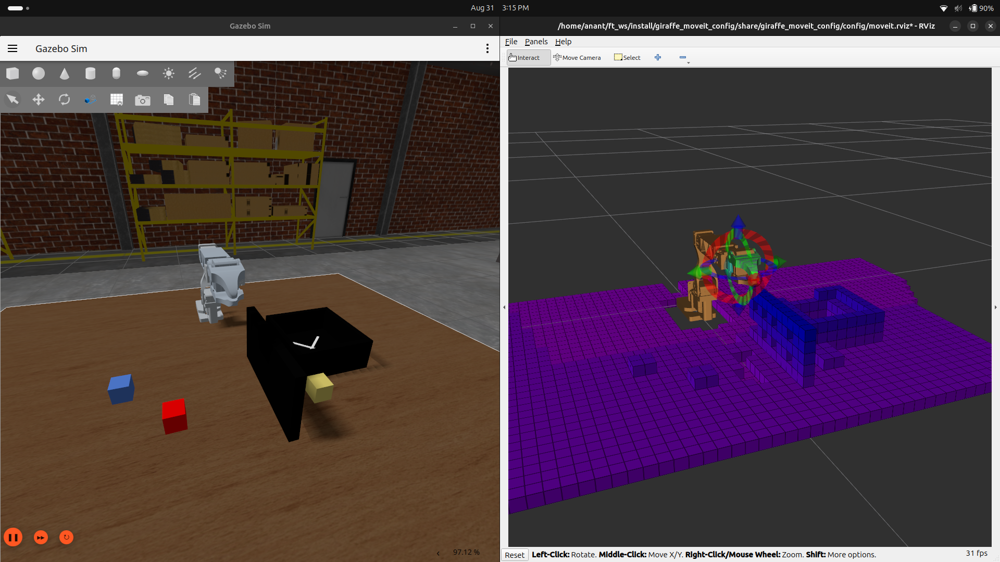
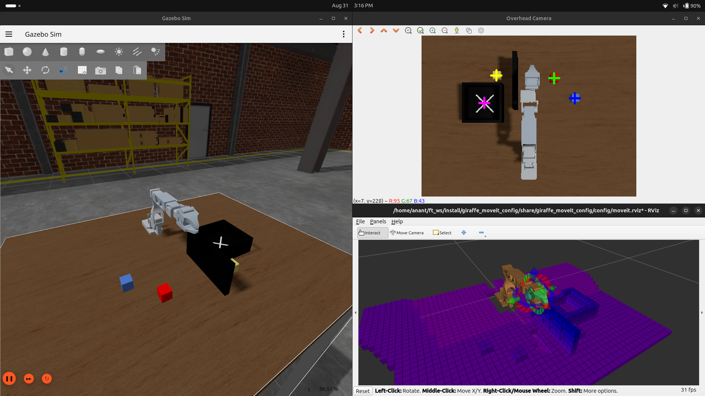
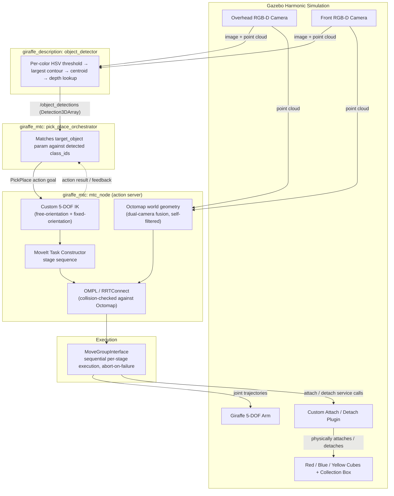
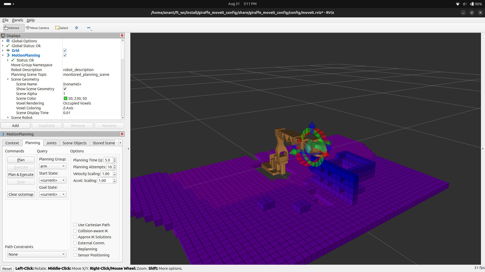

# Autonomous Pick-and-Place Manipulation Pipeline

A ROS 2 manipulation stack for a custom 5-DOF robotic arm ("Giraffe") in Gazebo Harmonic. Two RGB-D cameras localize objects in the workspace, an orchestration node selects a target and dispatches it as an action goal, and an action-server node computes a collision-aware grasp sequence with a custom inverse kinematics solver and drives execution end-to-end.


<!-- TODO: demo video/gif — full pick-and-place run, camera view + RViz side by side -->


## Capabilities

- Detects a target cube (red, blue, or yellow, selectable via parameter), plans a collision-aware grasp around obstacles in the scene, picks it up, and places it in a collection box — the action server stays alive and repeats this without restarting.
- A failed grasp is detected and retried automatically: the goal is aborted and the orchestrator dispatches a fresh one once the target is visible again (see [Recovery & Retry Mechanisms](#recovery--retry-mechanisms)).
- MoveIt's planning-scene "attach" and the cube's actual physical attach in Gazebo are two separate steps, bridged by a custom plugin (see [Grasp Physics](#grasp-physics-custom-gazebo-plugin)).

---

## Table of Contents

- [Capabilities](#capabilities)
- [Overview](#overview)
- [System Architecture](#system-architecture)
- [Repository Structure](#repository-structure)
- [Tech Stack](#tech-stack)
- [How It Works](#how-it-works)
  - Core Pipeline
    - [Perception](#perception)
    - [Orchestration and Action-Server Execution](#orchestration-and-action-server-execution)
    - [Custom 5-DOF Inverse Kinematics](#custom-5-dof-inverse-kinematics)
    - [Obstacle-Aware Planning with Octomap](#obstacle-aware-planning-with-octomap)
    - [MoveIt Task Constructor Pipeline](#moveit-task-constructor-pipeline)
    - [Grasp Physics: Custom Gazebo Plugin](#grasp-physics-custom-gazebo-plugin)
  - [Recovery & Retry Mechanisms](#recovery--retry-mechanisms)
    - [Runtime Re-Approach](#runtime-re-approach)
    - [Grasp-Attach Retry and Recovery](#grasp-attach-retry-and-recovery)
- [Notable Engineering Challenges](#notable-engineering-challenges)
- [Getting Started](#getting-started)
- [Usage](#usage)
- [Changelog](#changelog)
- [License](#license)

---

## Overview

The stack is split across five packages. `giraffe_description` holds the URDF/xacro model, sensor definitions, and the `object_detector` node. `giraffe_control` holds the `ros2_control` controller configuration. `giraffe_gazebo_plugins` provides a custom `gz-sim` plugin for physically attaching and detaching a grasped object. `giraffe_moveit_config` holds the MoveIt 2 configuration (SRDF, kinematics, OMPL pipeline). `giraffe_mtc` contains the two nodes that make up the manipulation logic: `pick_place_orchestrator`, which selects a target object and dispatches action goals, and `mtc_node`, which exposes pick-and-place as a ROS 2 action server built on a custom 5-DOF IK solver, MoveIt Task Constructor, and live octomap collision checking.

The arm has 5 revolute joints in the "arm" group and is not a standard 6-DOF, spherical-wrist manipulator — a pose target with both an exact position and an exact orientation is generically over-constrained for it. The IK strategy in `mtc_node` is built around that constraint rather than assuming a general-purpose IK plugin will handle it (see [Custom 5-DOF Inverse Kinematics](#custom-5-dof-inverse-kinematics)).

<!-- best-guess caption based on filename — correct if wrong -->
<!--  -->

<!-- best-guess caption based on filename — correct if wrong -->


## System Architecture



## Repository Structure

```
src/
├── giraffe_description/    # URDF/xacro, sensors, spawn + moveit_sim launch, object_detector node
├── giraffe_control/        # ros2_control controllers and configuration
├── giraffe_gazebo_plugins/ # Custom gz-sim attach/detach plugin
├── giraffe_moveit_config/  # MoveIt 2 configuration (SRDF, kinematics, planning pipelines)
└── giraffe_mtc/             # mtc_node (IK + octomap-aware MTC action server) and
                              # pick_place_orchestrator (target selection + goal dispatch)
```

`moveit_task_constructor` is a separate dependency, cloned alongside these packages rather than vendored in this repo — see [Getting Started](#getting-started).

## Tech Stack

| Component | Version              |
| --------- | --------------------- |
| Ubuntu    | 24.04                 |
| ROS       | Jazzy Jalisco          |
| Gazebo    | Gazebo Harmonic       |
| gz-sim    | 8.11.0                |
| Bridge    | `ros_gz_bridge`       |
| Simulator | Modern Gazebo (`gz sim`), not Gazebo Classic |

---

## How It Works

### Core Pipeline

The path every goal takes on a normal, successful run: perception feeds the orchestrator, the orchestrator dispatches a goal, `mtc_node` solves IK and builds an MTC task, and that task is planned and executed stage by stage. None of the sections below are fallback behavior — they run on every goal. Fallback and failure-handling logic is covered separately in [Recovery & Retry Mechanisms](#recovery--retry-mechanisms).

#### Perception

`object_detector` subscribes to synchronized RGB and depth image topics from both cameras and runs one detection pass per frame. The RGB frame is converted to HSV; each of the three cube colors and the collection box has its own fixed HSV threshold range, cleaned up with a fixed 3×3 erode/dilate pass. For each mask, contours are extracted, the largest contour above a minimum pixel-area threshold is taken as the detection, and its centroid is computed via image moments. That pixel is looked up in the synchronized depth image and mapped to a world-frame `(x, y, z)` through a fixed linear pixel-to-camera-coordinate calibration (two known correspondence points, hardcoded) and a fixed camera-to-world offset. All detections found in a given frame are packed into one `vision_msgs/Detection3DArray`, each entry carrying a `class_id` (`red_cube`, `blue_cube`, `yellow_cube`, `collection_box`) and a world-frame pose with identity orientation, and published on `/object_detections`.

The collection box uses a two-stage lookup: a black-region mask locates the box's bounding rectangle, then a white-marker mask is searched only inside that rectangle for a more precise center point. If no marker is found, the black region's own bounding-box center is used as a fallback. Thresholds and the pixel-to-world calibration constants are tuned to this simulated camera and lighting.

<!-- TODO: overhead camera screenshot showing the detection crosshairs on the cubes and box -->

<!-- rename your file from "Overhead Camera_screenshot.png" to "overhead_camera_screenshot.png" -->


#### Orchestration and Action-Server Execution

`pick_place_orchestrator` holds a `target_object` parameter (`red_cube`, `blue_cube`, or `yellow_cube`), validated on every set via `add_on_set_parameters_callback`. On each `/object_detections` message it scans for an entry whose `class_id` matches the target and an entry labeled `collection_box`. If both are present and no goal is currently in flight (tracked with an `std::atomic<bool>`), it sends a `PickPlace` action goal carrying the matched pick pose and the box's detected pose, and ignores further detections until that goal's result callback fires.

`mtc_node` exposes the pick-and-place sequence as the `PickPlace` action server (`rclcpp_action::Server`). `handleGoal` rejects a new goal if one is already active, or if `pick_pose` is exactly `(0, 0, 0)` (treated as an uninitialized goal). Accepted goals are executed on a detached `std::thread`, since planning and execution block for multiple seconds and the node's own executor thread needs to stay free for tf, the planning scene monitor, and action-server bookkeeping. `handleCancel` accepts cancellation requests but does not interrupt a motion already in progress — there is no cooperative cancellation point inside the execution loop. Per-stage progress (`"planning"`, `"descend to cube"`, `"lift up"`, ...) is published as action feedback as each MTC stage begins executing. On any failure the goal is aborted with a message and the node remains alive for the next goal; on the Gazebo-attach failure path specifically, the arm is also driven back to its start configuration before the abort (see [Grasp-Attach Retry and Recovery](#grasp-attach-retry-and-recovery)).

#### Custom 5-DOF Inverse Kinematics

With 5 joints, a target that pins down both an exact 3D position and an exact 3D orientation is generically over-constrained (6 degrees of constraint, 5 degrees of freedom). `mtc_node` handles this with two IK routines used for different parts of the sequence, both solving for the `wrist_2` link and then correcting for the fixed offset between `wrist_2` and the `gripper` link (`w2_to_grip_vec`, computed from the current robot state rather than hardcoded).

**`computeFreeOrientationIK`** — used for large Cartesian relocations (moving to the pre-grasp pose, moving to the place-approach pose). Orientation is not constrained: the first attempt uses the seed state's current wrist orientation unperturbed, and every subsequent attempt (up to `max_attempts = 400`) perturbs it by a random axis/angle up to `max_perturb_deg = 150°`, retrying `setFromIK` with `return_approximate_solution = true` and a `0.3s` per-attempt timeout. Joint 1 (`base_link_shoulder_pan_joint`) is not left to the random search — it's set analytically from `atan2(dy, dx)` between the shoulder-pan link and the target `(x, y)`, so every attempt starts already facing the target. A solution is accepted once `setFromIK` succeeds under the collision-checking validity callback and the resulting position error is under `max_pos_error = 15mm`. On exhaustion, `logIKFailureDiagnosis` re-runs IK once with collision checking disabled to distinguish "blocked by collision" from "kinematically unreachable" from "reachable but outside position tolerance," and logs the specific contact pairs or position error for debugging.

**`computeFixedOrientationIK`** — used for short, local motions (descend-to-grasp, lift, place-approach descend, descend-to-place) where a consistent, predictable wrist orientation matters more than search freedom. The desired orientation is supplied by the caller (see `computeDesiredWristOrientation` below) and joint 1 is re-derived the same analytical way from the seed state's own shoulder-pan pose, so the function is safe to call from any seed without depending on what a previous IK call left behind. It then searches in three escalating tiers around that corrected seed: a single deterministic attempt at zero jitter, then two tiers of `setToRandomPositionsNearBy` (radius `0.05`, then `0.15`) with 10 attempts each. If none of those converge within the `15mm` position tolerance at the exact desired orientation, a bounded fallback allows the orientation to drift by up to `15°` off the nominal target (versus the `150°` used by the free-orientation search), retried for 150 attempts with a full random-restart seed. This fallback exists because, at some `(x, y)` positions, exactly satisfying both the position and the desired orientation together is structurally infeasible for a 5-DOF arm — no amount of seed jittering fixes that, since the limitation isn't a bad local minimum. Whatever orientation is actually achieved is returned via `achieved_orientation`, so a chain of fixed-orientation calls along the same approach column (e.g. pick pose → descend → lift) can each be seeded with the previous call's achieved orientation instead of independently fighting the same infeasibility.

`computeDesiredWristOrientation` computes the orientation every fixed-orientation call in a given goal is anchored to: the wrist's orientation at the very start of the goal (captured once, before any motion), yawed by the difference between the initial base heading and the heading toward the current `(x, y)` target. Because it's always derived from that one fixed initial reference rather than the arm's current pose, every fixed-orientation stage aimed at the same `(x, y)` column computes the same answer regardless of when in the sequence it's called.

For the pick pose specifically, `computeFixedOrientationIK` is called twice in sequence — the first call's joint solution is used to build a new seed state, and a second call refines from that seed before the result is accepted. The place-approach leg does not repeat this refinement.

#### Obstacle-Aware Planning with Octomap

Point clouds from both cameras are fused into an Octomap that the planning scene exposes to OMPL as real collision geometry, checked during MTC's underlying `PipelinePlanner` stages (via `RRTConnect`) and during every custom IK call above through the same collision-checking validity callback. The octomap is force-cleared via a `/clear_octomap` service call and given a fixed re-observation window (`rclcpp::sleep_for(3s)`) at the start of every goal, since stale occupied voxels only clear when re-observed as free and could otherwise persist across goals. A world obstacle placed between the pick and place locations forces the planner to route around it rather than through it, rather than only ever needing to reason about the object being grasped.

<!-- TODO: RViz screenshot of the octomap voxel grid with a planned path routing around the obstacle -->


#### MoveIt Task Constructor Pipeline

Once all seven IK solves (pick free/fixed, descend, lift, place free/fixed, place-descend) complete, the sequence is built as an ordered list of MTC stages and planned as a single `mtc::Task`, in this order: current state (`FixedState`, seeded from the live planning scene) → allow gripper/cube collision (`ModifyPlanningScene`) → rotate wrist (`MoveRelative` on `wrist_1_wrist_2_joint`, +π/2) → move to target (`MoveTo`, free-orientation IK result) → fix orientation, grasp (`MoveTo`) → open gripper (`MoveTo`) → allow gripper/octomap collision (`ModifyPlanningScene`) → descend to cube (`MoveTo`) → close gripper (`MoveTo`) → attach cube (`ModifyPlanningScene`, planning-scene level only) → lift up (`MoveTo`) → disallow gripper/octomap collision (`ModifyPlanningScene`) → move to place (`MoveTo`) → fix orientation, place (`MoveTo`) → descend to place (`MoveTo`) → open gripper place (`MoveTo`) → detach cube (`ModifyPlanningScene`) → return to start (`MoveTo`, original joint values) → close gripper final (`MoveTo`). Every `MoveTo` stage that targets a precomputed IK solution applies a consistent +π/2 offset to `wrist_1_wrist_2_joint` on top of the raw joint values. Collision permissions (gripper-cube, gripper-octomap) are added and removed as their own stages at the point in the sequence where they're needed, rather than disabled globally for the whole task.

Arm `MoveTo`/`MoveRelative` stages use a shared `PipelinePlanner` (OMPL) at `0.2` velocity/acceleration scaling; gripper stages use a separate `JointInterpolationPlanner` at `0.1` scaling.

ROS 2 Jazzy's MTC build does not expose the `execute_task_solution` action server that newer setups use to hand a solved task directly to `move_group`. This is worked around by extracting each `SubTrajectory` from the planned `SolutionSequence` directly, re-time-parameterizing it with `TimeOptimalTrajectoryGeneration`, and executing it through `MoveGroupInterface::execute()` one stage at a time — checking the result of each stage before sending the next, rather than firing the whole sequence and hoping.

#### Grasp Physics: Custom Gazebo Plugin

MoveIt's planning-scene "attach object" operation only updates the collision model MoveIt itself reasons about — it has no physical effect in Gazebo. `CustomAttachPlugin` (`giraffe_gazebo_plugins`) bridges that gap: `mtc_node` calls its attach/detach ROS services at the appropriate points in execution, and the plugin creates or removes a physical joint between the gripper and the named model in the simulator, so the cube actually moves with the gripper in Gazebo rather than only in MoveIt's internal model of the world. The planning-scene side is only updated after the Gazebo service call confirms the physical attach succeeded, not in lockstep with it.

```xml
<plugin filename="libgiraffe_gazebo_plugins.so"
        name="giraffe_gazebo_plugins::CustomAttachPlugin">
    <parent_link>gripper</parent_link>
    <child_model>red_cube</child_model>
    <child_link>link</child_link>
</plugin>
```

### Recovery & Retry Mechanisms

Failure handling and drift correction layered on top of the core pipeline above. Nothing here runs on a clean, successful goal except the re-approach re-plans, which run unconditionally as an extra correction step; the attach-retry and recovery logic below only activates when something has already gone wrong.

#### Runtime Re-Approach

Two points in the execution loop re-solve IK from the arm's live state rather than trusting the plan built from the goal's initial seed state, since that seed was captured once before any motion happened and the arm may have drifted from it by the time execution reaches these stages. Immediately before executing the "descend to cube" and "open gripper place" sub-trajectories, `reapproachTarget` fetches a fresh robot state from the `CurrentStateMonitor`, re-runs `computeFixedOrientationIK` for the same `(x, y, z)` target and orientation the stage was already aiming for, and drives there via a fresh `arm_group.move()` call (a real collision-checked replan against the live monitored scene) before the originally-planned sub-trajectory executes.

#### Grasp-Attach Retry and Recovery

Attaching the cube physically in Gazebo is handled outside the planning-scene abstraction. At the "lift up" stage, `tryGazeboAttach` calls the plugin's attach service; on failure it is retried up to `MAX_ATTACH_ATTEMPTS = 3` times with no arm motion between attempts. A live re-plan isn't used as a broader recovery path here, since the gripper-cube collision permission only ever existed in MTC's internal planning-scene copy — a fresh replan from a state where the gripper is already touching the cube would immediately hit `START_STATE_IN_COLLISION`. If all attach attempts are exhausted, `recoverArmToStart` opens the gripper and drives the arm back to its starting configuration via a hand-built two-waypoint trajectory (bypassing `move()`'s collision-checked replanning for the same reason), then the goal is aborted so the orchestrator can dispatch a fresh one once the target is visible again. The planning scene only gets a matching `applyAttachedCollisionObject` call once the Gazebo attach is confirmed, so a failed-and-exhausted attempt never leaves it believing the gripper is holding something it isn't.

---

## Notable Engineering Challenges

- **Getting MTC to see the live octomap.** Building a fresh planning scene for MTC's first stage produced an empty world with no octomap in it, since it never inherited from the live, sensor-fed scene `move_group` maintains. Fixed by sourcing the first stage's `FixedState` from a `LockedPlanningSceneRO` diff of the live `PlanningSceneMonitor` instead of constructing one from scratch.
- **Distinguishing real obstacles from the robot's own body.** With too tight a self-filter margin, the cameras occasionally registered part of the arm's own base as an obstacle at certain joint angles, producing spurious invalid-goal-state failures. Required tuning the self-filter padding across the arm's full range of motion rather than only at a rest pose.
- **IK for a 5-DOF arm without a spherical wrist.** A single IK pass targeting an exact position and an exact orientation simultaneously is over-constrained for 5 joints and fails intermittently. Splitting into a free-orientation search for large relocations and a closely-seeded fixed-orientation solve (with a bounded orientation-relaxation fallback) for local motions resolved this — see [Custom 5-DOF Inverse Kinematics](#custom-5-dof-inverse-kinematics).
- **Stopping cleanly mid-sequence.** The execution loop originally kept firing every remaining stage's trajectory even after one had already failed to execute, since each later stage was planned assuming the previous one had actually moved the arm. `execution_failed` is now checked before every stage, and the loop breaks immediately on the first failure.
- **Retrying a failed grasp without corrupting the live planning scene.** A live replan immediately after a failed Gazebo attach hits `START_STATE_IN_COLLISION`, because the gripper-cube collision permission only ever existed inside MTC's own internal scene copy. The fix was to abort the whole goal on a confirmed attach failure rather than attempt an in-place re-grasp, and let the orchestrator dispatch a completely fresh goal, which rebuilds that permission correctly as its own stage before any motion runs.
- **A hand-built recovery trajectory rejected by the controller.** The retreat-to-start trajectory used on attach failure was originally seeded from a standalone `CurrentStateMonitor` state that could be stale, which the real controller rejected outright (`error -4`, `CONTROL_FAILED`) as soon as it didn't match the robot's actual position. Seeding it instead from `arm_group`/`gripper_group`'s own actively-maintained state monitors resolved it.

## Getting Started

### Prerequisites

See [Tech Stack](#tech-stack) above. A working ROS 2 Jazzy + Gazebo Harmonic development setup with `ros_gz_bridge` installed is required.

### Installation

```bash
# Create/enter your workspace
mkdir -p ~/ft_ws/src
cd ~/ft_ws/src

# Clone this repository
git clone <this-repo-url> .

# MoveIt Task Constructor is a separate dependency — clone it alongside
git clone --branch ros2 https://github.com/moveit/moveit_task_constructor.git
cd moveit_task_constructor
git submodule update --init --recursive
cd ..

# Install dependencies
cd ~/ft_ws
rosdep install --from-paths src --ignore-src -r -y

# Build
colcon build --symlink-install
source install/setup.zsh
```

## Usage

Run each of the following in its own terminal, with the workspace sourced.

**1. Launch the simulation, MoveIt, and RViz** — spawns the arm, the cubes, and the collection box:
```bash
ros2 launch giraffe_description moveit_sim.launch.py
```

**2. Launch the pick-and-place pipeline** — starts `object_detector`, `mtc_node`, and `pick_place_orchestrator` together, in order:
```bash
ros2 launch giraffe_mtc pick_place_mtc.launch.py target_object:=red_cube
```

`target_object` selects which cube to go after (`red_cube`, `blue_cube`, or `yellow_cube`; defaults to `red_cube`). It can also be changed at runtime without restarting:
```bash
ros2 param set /pick_place_orchestrator target_object blue_cube
```

The arm will detect the target cube, plan a collision-aware grasp around any obstacles in the scene, pick it up, carry it to the collection box, and return to its home position, ready to send the next goal once the target is visible again.

## Changelog

The full chronological development log — perception and simulation setup, MTC integration, and every major fix — is in [CHANGELOG.md](docs/ChangeLog.md).

## License

Released under the [MIT License](LICENSE).