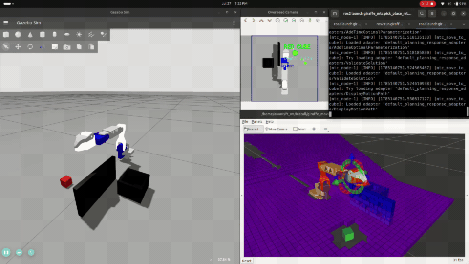
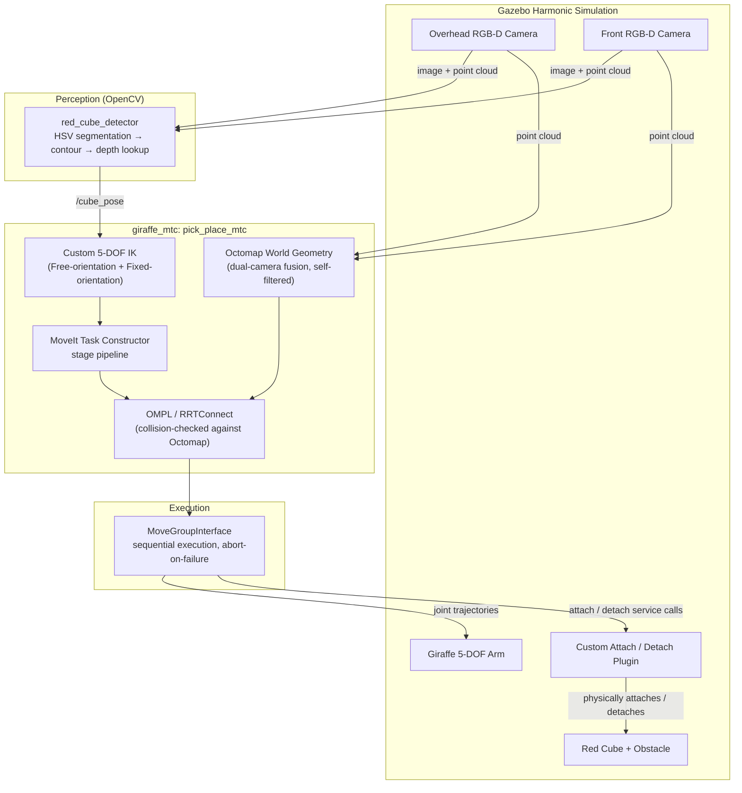
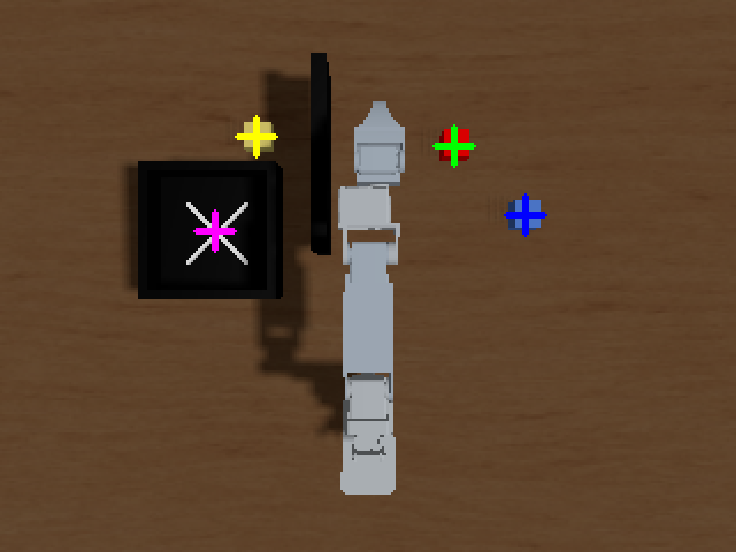
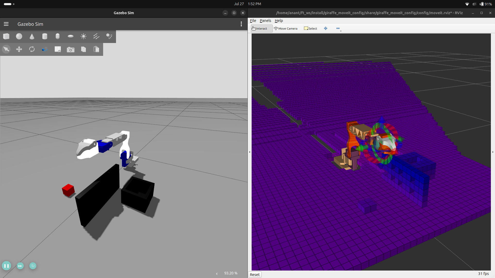

# Autonomous Pick-and-Place Manipulation Pipeline

A ROS 2 manipulation stack that fuses dual RGB-D perception, obstacle-aware motion planning, and a custom 5-DOF inverse kinematics solver to autonomously detect, grasp, and relocate an object in simulation — built around a custom-designed robotic arm ("Giraffe") in Gazebo Harmonic.


<!-- TODO: main demo video/gif — full pick-and-place run, camera view + RViz side by side -->


---

## Table of Contents

- [Overview](#overview)
- [Key Features](#key-features)
- [System Architecture](#system-architecture)
- [Repository Structure](#repository-structure)
- [Tech Stack](#tech-stack)
- [How It Works](#how-it-works)
  - [Perception](#perception)
  - [Custom 5-DOF Inverse Kinematics](#custom-5-dof-inverse-kinematics)
  - [Obstacle-Aware Planning with Octomap](#obstacle-aware-planning-with-octomap)
  - [MoveIt Task Constructor Pipeline](#moveit-task-constructor-pipeline)
  - [Grasp Physics: Custom Gazebo Plugin](#grasp-physics-custom-gazebo-plugin)
- [Notable Engineering Challenges](#notable-engineering-challenges)
- [Getting Started](#getting-started)
- [Usage](#usage)
- [Roadmap](#roadmap)
- [Changelog](#changelog)
- [License](#license)

---

## Overview

This project implements a full perception-to-manipulation pipeline for a 5-DOF robotic arm operating in a simulated environment. Two RGB-D cameras localize a target object, a custom motion-planning node computes a collision-aware grasp sequence around any obstacles in the workspace, and MoveIt Task Constructor drives execution end-to-end — from approach, to grasp, to placement, back to a home position.

The core of the repository is the `giraffe_mtc` pick-and-place node: a custom-built 5-DOF IK solver combined with MoveIt Task Constructor and live octomap collision checking, designed from the ground up to work around the constraints of a reduced-DOF arm rather than assuming a standard 6-DOF manipulator.

## Key Features

- **Dual RGB-D perception** — overhead and front-facing depth cameras provide overlapping coverage of the workspace.
- **OpenCV-based object localization** — classical HSV color segmentation converts a 2D detection into a 3D world-frame pose.
- **Custom 5-DOF inverse kinematics** — a purpose-built IK solver (Eigen + KDL) that works around the reachability limits of a non-spherical-wrist, reduced-DOF arm, instead of relying on a standard 6-DOF-oriented IK plugin.
- **Live obstacle avoidance via Octomap** — point clouds from both cameras are fused into a live occupancy map that OMPL checks against during planning, so the arm plans *around* obstacles instead of through them.
- **MoveIt Task Constructor pipeline** — the full pick-and-place sequence (approach, reorient, descend, grasp, lift, transit, place, return) is expressed as a composable MTC stage graph.
- **Custom Gazebo attach/detach plugin** — bridges MoveIt's abstract planning-scene "attach object" concept with real physics in simulation.
- **Failure-safe execution** — the execution loop verifies each trajectory actually completed before sending the next, instead of blindly running the whole sequence.

## System Architecture



## Repository Structure

```
src/
├── giraffe_description/    # URDF/xacro, sensors, spawn + moveit_sim launch, cube detector node
├── giraffe_control/        # ros2_control controllers and configuration
├── giraffe_gazebo_plugins/ # Custom Gazebo (gz-sim) attach/detach plugin
├── giraffe_moveit_config/  # MoveIt 2 configuration (SRDF, kinematics, planning pipelines)
└── giraffe_mtc/             # Pick-and-place node: custom IK, octomap-aware planning, MTC pipeline
```

`moveit_task_constructor` is a separate dependency, cloned alongside these packages rather than vendored in this repo — see [Getting Started](#getting-started).

## Tech Stack

| Component | Version                                          |
| --------- | ------------------------------------------------ |
| Ubuntu    | 24.04                                            |
| ROS       | **Jazzy Jalisco**                                |
| Gazebo    | **Gazebo Harmonic**                              |
| gz-sim    | **8.11.0**                                       |
| Bridge    | `ros_gz_bridge`                                  |
| Simulator | Modern Gazebo (`gz sim`), **not Gazebo Classic** |

---

## How It Works

### Perception

The `red_cube_detector` node subscribes to the RGB and depth streams from both cameras and locates the target object using classical computer vision. The RGB image is converted from BGR to HSV, since HSV makes color isolation far more robust to lighting than raw RGB thresholds. Two HSV ranges are applied to detect red, producing a binary mask, which is then cleaned up with morphological erosion and dilation to remove noise. Contours are extracted from the mask, the largest contour above a minimum area is assumed to be the cube, and its centroid is computed via image moments. That pixel location is then looked up in the synchronized depth image and projected into a 3D world-frame coordinate, which is published as the cube's pose for the planner to consume.

<!-- TODO: screenshot of the HSV mask / detected contour overlay next to the RGB feed -->


### Custom 5-DOF Inverse Kinematics

Most MoveIt IK plugins assume a 6-DOF arm with a spherical wrist, where any reachable position can be paired with any orientation. A 5-DOF arm doesn't have that freedom — position and orientation together are 6 constraints, and 5 joints generally can't satisfy an arbitrary combination of both at once. Rather than fight that limitation with a stock solver, this project uses a purpose-built IK approach: Eigen is used to compute the base (shoulder-pan) yaw needed to face a target, and KDL is handed a much simpler, well-seeded problem to solve the remaining wrist joints — effectively decomposing a hard 5-DOF search into an easy rotation calculation plus a small numerical solve.

That solver is further split into two explicit modes, used for different parts of the motion:

- **Free-orientation IK**, used for large relocations (moving to the pre-grasp pose, moving to the place-approach pose). Orientation is allowed to float within a bounded random search, since letting the "missing" degree of freedom move is what makes these long reaches reliably solvable.
- **Fixed-orientation IK**, used for short local motions (descending onto the object, lifting, descending to place). Orientation is held as close as possible to a consistent, predictable value — seeded from the pose the Free-orientation solve already found at that position — so the arm approaches the grasp at a repeatable angle instead of an arbitrary one.

### Obstacle-Aware Planning with Octomap

Point clouds from both the overhead and front cameras are fused into a live Octomap, which MoveIt's planning scene exposes to OMPL as real collision geometry — not just for the perception system to visualize, but as something the collision checker actually reasons about during planning. Motion plans are validated against this live occupancy map, so the arm plans a path around workspace obstacles instead of straight through them.

The world includes a physical obstacle placed between the pick and place locations, so the arm is forced to plan around it rather than through it — a direct demonstration of the collision-aware planning working end-to-end, rather than only being collision-aware for the object being grasped.

<!-- TODO: RViz screenshot of the octomap voxel grid with the arm routing around the obstacle -->


### MoveIt Task Constructor Pipeline

The full pick-and-place sequence is expressed as a chain of MTC stages: rotate the wrist, approach the pre-grasp pose, correct orientation, open the gripper, descend, close the gripper, attach the object, lift, transit to the place location, correct orientation again, descend, release, detach, and return home. Collision permissions are scoped narrowly and temporarily around the grasp point (e.g. permitting the gripper to contact the object it's about to pick up) rather than disabled globally, so the arm stays collision-aware everywhere else in the sequence.

ROS 2 Jazzy's MTC currently lacks the `execute_task_solution` action server that newer setups use to hand a solved MTC task straight to `move_group` for execution. This pipeline works around that by extracting the individual sub-trajectories directly from the MTC solution, re-parameterizing them with time-optimal trajectory generation, and executing them sequentially through `MoveGroupInterface` — verifying each stage actually completed before sending the next, rather than firing off the whole sequence blind.

### Grasp Physics: Custom Gazebo Plugin

MoveIt's planning-scene "attach object" call is purely conceptual — it updates the collision model MoveIt reasons about, but it doesn't do anything physically in simulation. A custom `gz-sim` plugin (`CustomAttachPlugin`) bridges that gap: at the right point in the execution sequence, the node calls ROS services that tell the plugin to create or remove a physical joint between the gripper and the object, so the cube actually moves with the gripper in Gazebo rather than just in MoveIt's internal model of the world.

```xml
<plugin filename="libgiraffe_gazebo_plugins.so"
        name="giraffe_gazebo_plugins::CustomAttachPlugin">
    <parent_link>gripper</parent_link>
    <child_model>red_cube</child_model>
    <child_link>link</child_link>
</plugin>
```

---

## Notable Engineering Challenges

A few problems that took real debugging to get right — full detail in [CHANGELOG.md](docs/ChangeLog.md):

- **Getting MTC to actually see the octomap.** The obvious approach — constructing a fresh planning scene for MTC's first stage — silently produced an *empty* world with no octomap in it at all, since it never inherited anything from the live, sensor-fed scene `move_group` was maintaining. The fix was sourcing that first stage's scene from the same live `PlanningSceneMonitor`, not building one from scratch.
- **Telling real obstacles apart from the robot's own body.** With too tight a self-filter margin, the cameras would occasionally perceive part of the arm's own base as an obstacle at certain joint angles, producing phantom "invalid goal state" failures. Fixing it meant tuning the self-filter padding across the arm's full range of motion, not just at rest.
- **Solving IK for a 5-DOF arm without a spherical wrist.** A single IK approach that tried to hit an exact position *and* an exact orientation simultaneously would intermittently fail, since that's over-constrained for 5 joints. Splitting into a free-orientation search for long reaches and a fixed-orientation, closely-seeded solve for local motions resolved it.
- **Keeping a multi-stage sequence safe when one stage fails mid-run.** Early on, the execution loop kept firing every remaining stage's trajectory even after one had aborted mid-sequence — each new trajectory planned on the assumption the previous one had actually moved the arm. The loop now checks the result of every stage and stops immediately on failure.

## Getting Started

### Prerequisites

See [Tech Stack](#tech-stack) above. You'll also need a working ROS 2 Jazzy + Gazebo Harmonic development setup with `ros_gz_bridge` installed.

### Installation

```bash
# Create/enter your workspace
mkdir -p ~/ft_ws/src
cd ~/ft_ws/src

# Clone this repository
git clone <this-repo-url> .

# MoveIt Task Constructor is a separate dependency — clone it alongside
git clone --branch ros2 https://github.com/moveit/moveit_task_constructor.git
cd moveit_task_constructor
git submodule update --init --recursive
cd ..

# Install dependencies
cd ~/ft_ws
rosdep install --from-paths src --ignore-src -r -y

# Build
colcon build --symlink-install
source install/setup.zsh
```

## Usage

Run each of the following in its own terminal (with the workspace sourced), in order:

**1. Launch the simulation, MoveIt, and RViz** — spawns the arm, the cube, and the collection tray:
```bash
ros2 launch giraffe_description moveit_sim.launch.py
```

**2. Start the perception node:**
```bash
ros2 run giraffe_description red_cube_detector
```

**3. Run the pick-and-place pipeline:**
```bash
ros2 launch giraffe_mtc pick_place_mtc.launch.py
```

The arm will detect the cube, plan a collision-aware grasp around any obstacles in the scene, pick it up, carry it to the place location, and return to its home position.

> The perception node currently runs standalone rather than being launched by `pick_place_mtc.launch.py` — see [Roadmap](#roadmap).

## To-Do / Roadmap

#### Functional
- [] Make the error checker value offset in y axis more than error in x axis. (have statistical analysis between the two methords)(suspicion 2 make the cube not be considered while ik calculation suspicion 3 check the cube offset in movit is that casuing the issue?)
- [] add floor to bottom so it does not occasionally hit the table while descending.
#### Visual
- [] Make execution faster.(Unified speed control?)
- [] Remove the first head turn. (make it happen while the calculations happen?)
#### Efficiency
- [] Revisit the execution architecture for better concurrency ("thread stuff").
#### Done
- [X] Bundle the cube-detector node into the pick-and-place launch file for a single-command startup.
- [X] Add container detection and pose estimation as well.
- [X] Add offsets to detection or add the control loop for final place. (The Attach check works as loop control for now)
- [X] Further set-dress the simulation world (additional obstacles, tray placement, etc.).
- [X] Add more coloured cubes and containers.
- [X] Extend the custom Gazebo plugin beyond simple attach/detach for all cubes.
- [X] If cube wasen't picked up tries again (Already does but after complete execution)
- [X] Add check attach success/failure retry logic.
- [X] Fix to movit attach object error.
- [X] Fix the attach happening when cube not in between the two gripper fingers.
- [x] Make it stop once the cube is in box.
- [X] make the cv window text look better. (Removed Text only)
- [X] change colour of arm sometimes object detection gets confused.
#### Not Doing
- [] check if the moveit block object is somehow affecting the planning in the first phase causing the issues more.(NO BALL)


## Changelog

The full chronological development log — including the perception/simulation setup, the MTC integration work, and every major fix — lives in [CHANGELOG.md](docs/ChangeLog.md).

## License

Released under the [MIT License](LICENSE).